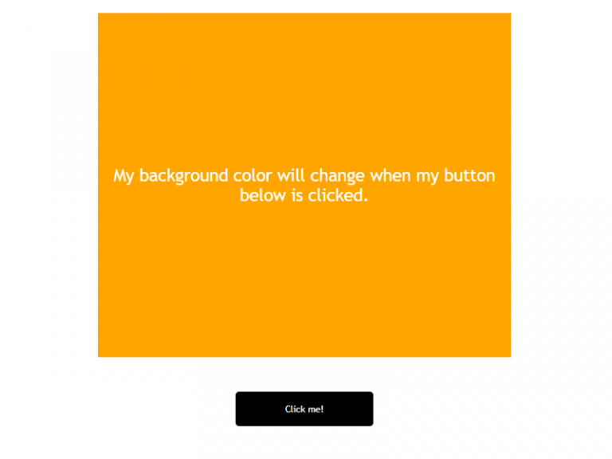

# Color Change App

# What You Should See
Visit the hosted github page to see this [Color Changing App]() in action.

# Project Objective
The objective for this JavaScript color change app project is to change the color of the canvas when the user clicks on a button.

# JavaScript Used
* eventListener
* Array
* Math.random

# New Things Learned or Refreshed
Nothing new in this project.

I coded it pretty fast.

And I even coded the CSS by myself, using the new flex-box feature.

